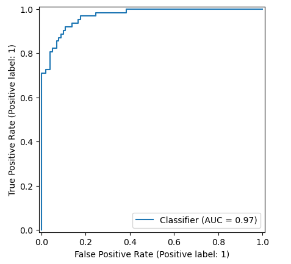
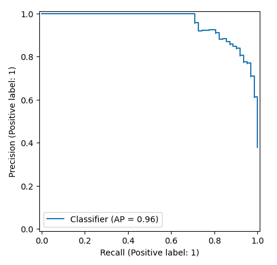
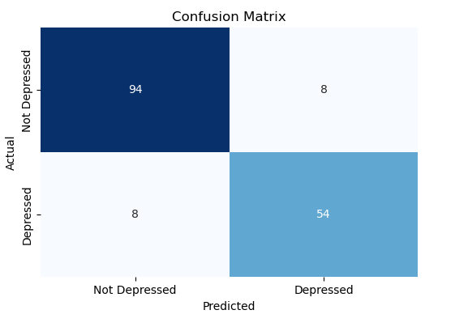
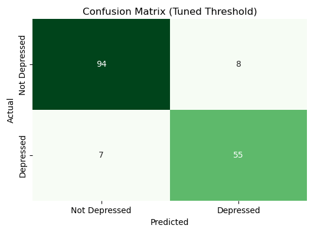

# Postpartum Depression Prediction

## Overview
This project explores the prediction of postpartum depression using survey data.  
I built a logistic regression model that can carry out:
- **6-month depression prediction** (`depressed_6m`)
- **1-year depression prediction** (`depressed_1y`)

The workflow covers:
- Data preprocessing  
- Baseline model creation  
- Hyperparameter tuning  
- Threshold tuning for better control over false positives vs. false negatives  
- Model saving (with threshold included)

## Project Structure
```
sca__challenge/
│── dataset/
│    └── THP_clean.csv # CSV dataset
│── notebook/ # Jupyter Notebooks
│    └── PPDepression.ipynb # Main notebook
├── images/
│    └── AUC-ROC-SCA.png
│    └── AUC-ROC-SCA-2.png
│    └── Confusion-matrix-SCA.png
│    └── Confusion-matrix-SCA-2.png
│── logreg_best_with_threshold.pkl # Saved model with threshold
└──  README.md # Project documentation

```

## Key Steps
1. **Baseline Logistic Regression**  
   - Achieved strong accuracy and ROC-AUC.  

2. **Hyperparameter Tuning**  
   - Improved generalization and performance.  

3. **Threshold Tuning**  
   - Optimized trade-off between precision, recall, and F1 score.  
   - Best threshold stored alongside the trained model.  

## Methodology
### Data Preparation
- Imported dataset (THP_clean.csv).
- Identified target variables: `depressed_6m` and `depressed_1y`.
- Dropped irrelevant columns (e.g., IDs, interviewer info). 
- Handled missing values (in the pipeline) using:
- Median imputation for numeric columns.
- Most-frequent imputation for categorical columns.

### Pipeline Setup
- Built preprocessing pipelines to automatically handle:
  - Imputation (numeric + categorical).
  - Encoding of categorical variables.
  - Scaling of numeric variables.
- Combined preprocessing with Logistic Regression in a single scikit-learn Pipeline.


### Train-Test Split
- Split dataset into 80% training and 20% testing subsets.
- Ensured reproducibility with fixed `random_state`.
  
### Baseline Modeling
- Created a baseline Logistic Regression model.
- Evaluated with *accuracy*, *precision*, *recall*, *F1-score*, and *ROC-AUC*.
  
### Hyperparameter Tuning
- Applied GridSearchCV with 5-fold cross-validation.
- Tuned parameters such as `C` (regularization strength) and `class_weight`.
- Selected best model based on ROC-AUC.
  
### Threshold Tuning
- Explored thresholds between 0 and 1.
- Chose the threshold that maximized F1-score to balance precision and recall.
- Implemented custom prediction function using the best threshold.

### Model Saving
- Saved best model and chosen threshold together using `joblib`.
- Ensured reusability by storing both model and threshold in one `.pkl` file.

### Refactoring for Flexibility
- Introduced a global `target` variable at the top of the notebook.
- Allowed seamless switching between `depressed_6m` and `depressed_1y` without duplicating code.
- `depressed` cannot be used as it leads to overfitting of the model

## Results
- **Accuracy (baseline):** ~90%  
- **ROC-AUC:** ~97%  
- **Best F1 threshold tuning:** Balanced **false positives** and **false negatives**

## Visualisations





## How to Use
### Load the Saved Model
```python
import joblib

saved = joblib.load("logreg_best_with_threshold.pkl")
model = saved["model"]
threshold = saved["threshold"]


# Predict with custom threshold
y_proba = model.predict_proba(X)[:, 1]
y_pred = (y_proba >= threshold).astype(int)
```

### Next Steps
- Extend modeling to other depression-related columns.
- Experiment with advanced models (Random Forest, XGBoost, etc.).
- Deploy as an app for clinical or research use.

### Motivation

The ultimate goal is to support early detection of postpartum depression,
helping healthcare providers and families identify at-risk mothers sooner.
