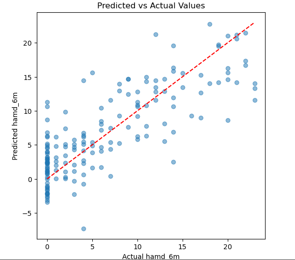
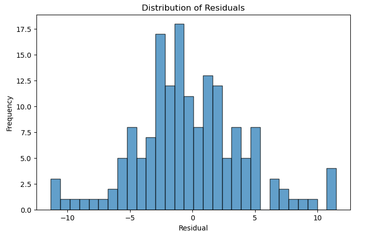
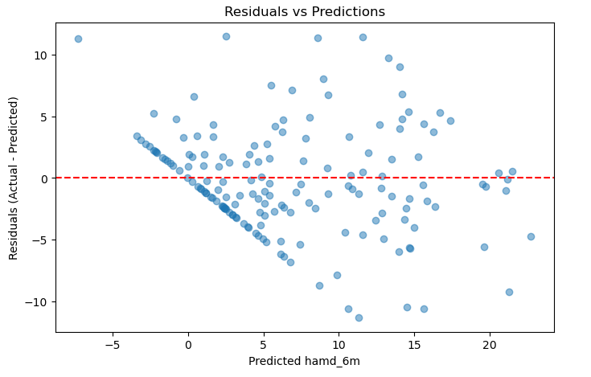

# Postpartum Depression Prediction

## Overview
This project explores predicting postpartum depression severity at 6 months (`hamd_6m`) using a linear regression model. 
The focus is on building a robust predictive model—minimizing leakage, ensuring valid feature use, and achieving generalizable performance.

The workflow covers:
- Data preprocessing  
- Baseline model creation  
- Model saving

## Project Structure
```
sca__challenge/
│── dataset/
│    └── THP_clean.csv # CSV dataset
│── notebook/ # Jupyter Notebooks
│    └── PPDepression.ipynb # Main notebook
|── images/
│    └── Residuals.png
│    └── Pedicted_vs_actual.png
│    └── Residuals_vs_predictions.png
│── logreg_best_with_threshold.pkl # Saved model with threshold (Logistic Regression)
|── linear_regression_pipeline.joblib # Saved linear regression model
└──  README.md # Project documentation

```


## Methodology
1. **Data Cleaning & Target Handling**
   - Dropped rows with missing `hamd_6m`.
   - Removed features with >40% missing values.
   - Detected and dropped leakage: all “6m” columns and features with correlation >0.9.
2. **Preprocessing Pipeline**
   - Numeric features: median imputation + scaling.
   - Categorical features: constant imputation + one-hot encoding.
3. **Model Training**
   - Train-test split (80% / 20%), `random_state=42`.
   - Pipeline: preprocessing + `LinearRegression`.
4. **Evaluation**
   - **MAE**: 3.28  
   - **RMSE**: 4.26  
   - **R²**: 0.63  
   - Visual diagnostics: Predicted vs Actual, Residual plots.

## Visualisations




## How to Use
### Load the Saved Model
```python
import joblib
pipeline = joblib.load("linear_regression_pipeline.joblib")
predictions = pipeline.predict(X_new)
# ... evaluate or analyze as needed
```

## Results
| Metric                         | Value      | Meaning                                                                                          |
|--------------------------------|------------|--------------------------------------------------------------------------------------------------|
| MAE (Mean Absolute Error)      | 3.28       | On average, predictions are off by about 3.3 points from the actual depression scores.           |
| RMSE (Root Mean Squared Error) | 4.26       | Errors are larger when squared (penalizes big mistakes more); typical error size is ~4.3 points. |
| R² (R-squared)                 | 0.63       | The model explains about 63% of the variance in the target (`hamd_6m`) i.e.                      |
|                                |            |  How much of the spread (people with low, medium and high scores) in the real scores can the     |
|                                |            | model’s predictions actually capture/explain?                                                    |


### Next Steps
- Visualize feature importance.
- Explore Ridge / Lasso regression.
- Cross-validation and hyperparameter tuning.
- Expand to other outcome variables or deployable app.

### Motivation

The ultimate goal is to support early detection of postpartum depression,
helping healthcare providers and families identify at-risk mothers sooner.
